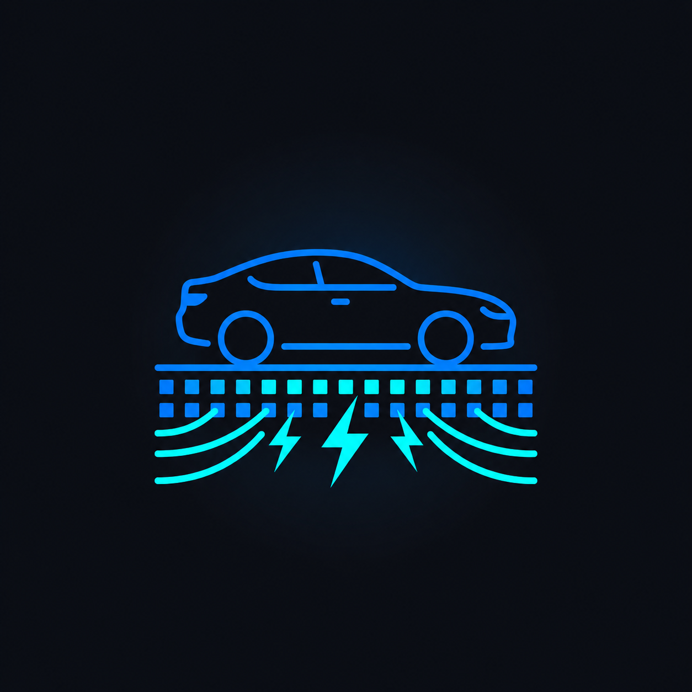

<div align="center">

<table border="0" cellpadding="0" cellspacing="0">
  <tr>
    <td valign="middle" width="160">
      
    </td>
    <td valign="middle" align="left" style="padding-left: 24px;">
      <h1>⚡ PiezoRoad</h1>
      <h3><em>Turning Every Journey Into Clean Energy</em></h3>
      <p><strong>A real-time 3D simulation of piezoelectric road energy harvesting —<br/>visualizing the future of sustainable urban infrastructure.</strong></p>
    </td>
  </tr>
</table>

<br/>

[](https://AounYoussef.github.io/PiezoRoad/)
[](https://github.com/AounYoussef/PiezoRoad)
[](https://github.com/AounYoussef/PiezoRoad/actions)

<br/>

[](https://react.dev)
[](https://threejs.org)
[](https://typescriptlang.org)
[](https://vitejs.dev)
[](https://tailwindcss.com)
[](LICENSE)

<br/>


</div>

---

## 🌍 The Problem We're Solving

Every day, **billions of vehicles** travel across roads worldwide — each one exerting thousands of newtons of force on the road surface. That mechanical energy is **entirely wasted**, absorbed silently into asphalt and concrete.

Meanwhile, the world urgently needs clean, renewable energy sources embedded into existing infrastructure — without requiring new land, new towers, or new disruption.

> **What if every car that drove past generated electricity?**

---

## 💡 The Concept: Piezoelectric Roads

**Piezoelectricity** is the ability of certain materials (like crystals, ceramics, and polymers) to generate an electric charge in response to mechanical stress — in other words, **pressure becomes power**.

PiezoRoad envisions embedding a **dense grid of piezoelectric sensors** directly into road surfaces. When vehicles drive over them, the weight and vibration of traffic is converted into electrical energy that is captured, stored, and fed into the grid.

```
🚗 Vehicle Weight
       ↓
🟦 Piezoelectric Sensor  →  ⚡ Electrical Pulse  →  🔋 Battery Storage  →  🏙️ City Grid
```

### Real-World Impact

| Metric | Estimate |
|--------|----------|
| Energy per vehicle pass | ~0.05 – 0.20 kWh |
| 1 km of busy road (daily) | ~200 – 400 kWh |
| CO₂ offset (per 100 kWh) | ~40 kg of CO₂ |
| Sensor lifespan | 5 – 10 years |

---

## 🎮 What This Simulation Does

PiezoRoad is an **interactive 3D real-time simulation** built with React and Three.js that lets you visualize this concept in action.

### Core Features

| Feature | Description |
|---------|-------------|
| 🚗 **Live Traffic Simulation** | 4 cars continuously drive across the road at varying speeds, each triggering energy pulses on the piezo grid |
| ⚡ **Energy Pulse Visualization** | Every time a vehicle passes a sensor, a blue energy pulse animates toward the battery unit in real time |
| 🔋 **Live kWh Counter** | Total energy generated is tallied live and displayed as an accumulating kWh readout |
| 🌿 **CO₂ Offset Tracker** | Converts energy generated to equivalent kilograms of CO₂ avoided (0.4 kg/kWh) |
| 🟦 **1,000-Sensor Smart Grid** | A 10×100 grid of piezoelectric modules covers the road surface, each color-coded by health status |
| 🖱️ **Clickable Sensor Inspection** | Click any individual sensor to open a panel showing its damage level and operational status |
| 🌙 **Day / Night Toggle** | Switch between a bright daytime city scene and a dark night mode with a starfield sky |
| 🎥 **Orbit Camera** | Drag to orbit, scroll to zoom — explore the full road simulation from any angle |

### Sensor Health System

The simulation models sensor degradation with a realistic damage model:

```
🟢 Green   (0–30% damage)   — Optimal: generating full power
🟡 Yellow  (31–70% damage)  — Degraded: operating at reduced efficiency
🔴 Red     (71–100% damage) — Critical: maintenance required immediately
```

---

## 🛠️ Tech Stack

| Layer | Technology | Purpose |
|-------|-----------|---------|
| **Frontend Framework** | React 19 | Component architecture & state management |
| **3D Rendering** | Three.js + React Three Fiber | WebGL-powered 3D scene |
| **3D Helpers** | @react-three/drei | OrbitControls, Stars, Environment, Shadows |
| **Animations** | Motion (Framer Motion) | UI enter/exit transitions, micro-animations |
| **Styling** | Tailwind CSS v4 | Utility-first responsive design |
| **Icons** | Lucide React | Clean, consistent iconography |
| **Build Tool** | Vite 6 | Lightning-fast HMR dev server + production builds |
| **Language** | TypeScript | Type-safe component interfaces |
| **CI/CD** | GitHub Actions | Auto-deploy to GitHub Pages on every push |

---

## 🚀 Getting Started

### Prerequisites

- [Node.js](https://nodejs.org/) v18 or higher
- npm v9 or higher

### Installation

```bash
# 1. Clone the repository
git clone https://github.com/AounYoussef/PiezoRoad.git
cd PiezoRoad

# 2. Install dependencies
npm install

# 3. Start the development server
npm run dev
```

Open **http://localhost:3000** in your browser. The simulation starts immediately — no API keys, no accounts, no setup required.

### Available Scripts

```bash
npm run dev      # Start local development server (port 3000)
npm run build    # Build optimized production bundle → dist/
npm run preview  # Preview the production build locally
npm run lint     # Type-check with TypeScript
```

---

## 🗂️ Project Structure

```
PiezoRoad/
├── src/
│   ├── components/
│   │   ├── Simulation.tsx    # 3D scene: road, cars, sensors, battery, energy pulses
│   │   └── UI.tsx            # HUD: energy counter, CO₂ tracker, sensor panel, controls
│   ├── App.tsx               # Root component — wires simulation + UI state
│   ├── main.tsx              # React entry point
│   └── index.css             # Global styles + glassmorphism utilities
├── img/
│   └── logo_v2.png           # Project logo
├── .github/
│   └── workflows/
│       └── deploy.yml        # GitHub Actions → GitHub Pages CI/CD pipeline
├── index.html                # HTML entry point
├── vite.config.ts            # Vite build configuration
├── tsconfig.json             # TypeScript configuration
└── package.json              # Dependencies & scripts
```

---

## 🔬 Technical Deep-Dive

### Energy Generation Model

Each car uses `useFrame` (Three.js render loop) to track its real-time position. Every **5 road units** traversed, it fires an energy pulse:

```ts
// Energy per sensor pass: random between 0.05–0.20 kWh
// Models variability based on vehicle weight, speed, and sensor wear
onPass(Math.random() * 0.15 + 0.05, currentPos);
```

### The 1,000-Sensor Smart Grid

The road contains a **10 × 100 grid** of individually-addressable piezoelectric modules. Each module:
- Has a randomly assigned **damage percentage** (0–100%)
- Is rendered with **color-coded glow** based on health status
- Is **clickable** — opening a real-time inspection panel
- Uses `emissiveIntensity` to make critical sensors visually alarming

```ts
const color = isSelected ? "#2563EB"
            : isCritical ? "#ef4444"   // >70% damage — red alert
            : isWarning  ? "#FACC15"   // >30% damage — yellow warning
            :              "#22C55E";  // healthy — green
```

### Energy Pulse Animation

When energy is harvested, a glowing plane spawns at the sensor's world position and smoothly `lerp`s toward the battery storage unit using Three.js's built-in interpolation — visualizing real energy flow through the road system.

---

## 🌐 Live Demo

Deployed automatically via GitHub Actions on every push to `main`:

**🔗 [https://AounYoussef.github.io/PiezoRoad/](https://AounYoussef.github.io/PiezoRoad/)**

---

## 🔭 Future Roadmap

- [ ] Real sensor hardware integration via WebSocket
- [ ] Traffic density slider (rush hour / off-peak simulation)
- [ ] Historical energy analytics dashboard with charts
- [ ] Multi-road comparison mode
- [ ] Economic ROI calculator (installation cost vs. energy revenue)
- [ ] Mobile-optimized responsive layout
- [ ] Road type selector (highway, city street, roundabout)
- [ ] Export data as CSV / JSON report

---

## 🤝 Contributing

Contributions, ideas, and feedback are welcome!

1. Fork the repository
2. Create a feature branch: `git checkout -b feature/your-feature`
3. Commit your changes: `git commit -m 'Add your feature'`
4. Push to the branch: `git push origin feature/your-feature`
5. Open a Pull Request

---

## 📄 License

This project is licensed under the **MIT License**.

---

<div align="center">

**Built with ❤️ for a cleaner, smarter planet.**

*PiezoRoad — Because the road to the future should power the future.*

</div>
